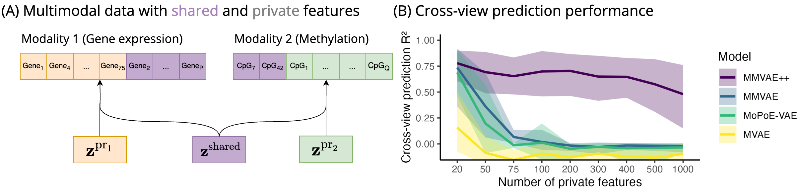

# Shared-private multimodal VAEs

Code for our paper **"Disentangling shared and private latent factors in multimodal Variational Autoencoders"** which was published in the proceedings of MLCB 2023. 



In [experiments/core.py](experiments/core.py), we provide the implementation and training script for various versions of MVAEs, MMVAEs and MoPoE-VAEs. You can find the main model classes in [multimodalVAE/MVAE.py](multimodalVAE/MVAE.py) and [multimodalVAE/MMVAE.py](multimodalVAE/MMVAE.py). 

We use [hydra](https://hydra.cc/) framework to configure the experiments and [W&B](https://wandb.ai/site) for tracking. Below are examples how to train various versions of multimodal VAEs. Note that `model.name` can take values in `[MVAE, MoPoE-VAE, MMVAE, MMVAE++]`. 

### Toy data experiments

Data generated using the GP model (loaded via `dataset.name=toy_GP`). As this is a synthetically generated dataset, we can additionally provide `dataset.dim_z="2+2+2"`. 

```
python experiments/experiment.py --multirun model.name=MMVAE,MMVAE++,MVAE,MoPoE-VAE dataset.name=toy_GP dataset.n_genes_top=10 dataset.n_genes_bottom=20,50,100,250 +dataset.n_cpgs_bottom=100 dataset.dim_z="2+2+2" trainer.lr=1e-3
```

### Breast Cancer ER-status experiment

BRCA expression and methylation data (loaded via `dataset.name=BRCA_ER_exprs_and_meth`)

```
python experiments/experiment.py --multirun model.name=MMVAE,MMVAE++,MVAE,MoPoE-VAE dataset.name=BRCA_ER_exprs_and_meth dataset.n_genes_top=1000 dataset.n_genes_bottom=500 +dataset.n_cpgs_top=1000 +dataset.n_cpgs_bottom=25000 trainer.lr=1e-4 trainer.n_epochs=500
```


### Single cell RNA-seq and ATAC-seq experiment


Single cell RNA-seq and ATAC-seq experiment (loaded via `dataset.name=MOFA_RNA_ATAC`)

```
python experiments/experiment.py --multirun model.name=MMVAE,MMVAE++,MVAE,MoPoE-VAE dataset.name=MOFA_RNA_ATAC dataset.n_genes_top=10 dataset.n_genes_bottom=10,100,1000 +dataset.n_cpgs_bottom=5000 trainer.lr=1e-4 trainer.n_epochs=100
```
